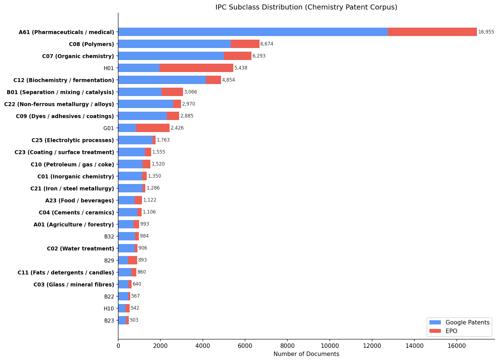

# Multi-Lingual QAC for Chemistry Patents

Building a multilingual question / answer / context dataset from chemistry patents — pipeline, modes, and human evaluation.

---

## Agenda

1. **Data collection** — Google Patents and EPO sources
2. **Query generation pipeline** — prompts, verifiers, modes, strategies
3. **Human evaluation** — annotator scores vs. the LLM auto-grader

---

## Data sources at a glance

- Two complementary sources, **14,401 unique documents** after dedup, **0 duplicates** between them.
- **Google Patents** — broad temporal coverage and the Spanish branch.
- **EPO bulk** — near-complete trilingual (en / fr / de) and richer field coverage (first claim + description).
- The two sources do **not** overlap in time: GP runs 1999–2025, EPO is the 2026 window.

| Source | Docs | Rows | Languages | Date range |
|---|---|---|---|---|
| Google Patents | 10,628 | 23,387 | en, fr, es, de | 1999-03 – 2025-10 |
| EPO            | 3,773  | 11,315 | en, fr, de     | 2026-04 – 2026-05 |

---

## Google Patents

- **10,628 documents / 23,387 multilingual rows**, March 1999 – October 2025.
- Languages: en 10,827 · fr 8,805 · es 2,154 · de 1,601.
- Field coverage: **abstract 100%**, no claims, no descriptions.
- Strong en↔fr pairing (8,800 docs); es is unique to this source.
- Top countries: WO 14,810 · EP 4,525 · MX 3,876.
- Top IPC classes: **A61** 12,743 · **C08** 5,320 · **C07** 4,985 · **C12** 4,140.

---

## EPO bulk

- **3,773 documents / 11,315 rows**, April – May 2026 window.
- Near-complete trilingual: en 3,773 · de 3,770 · fr 3,772.
- Field coverage: **first claim 100%**, description 33.3%, no abstracts.
- All documents are EP country code.
- Top IPC classes: **A61** 4,212 · **H01** 3,484 · **G01** 1,580 · **C08** 1,354.
- Complements Google Patents on fields (claims / descriptions) and on the en/de/fr trilingual axis.

---

## IPC distribution

A61 (medical / pharma) dominates both sources; the C-class chemistry tail (C07, C08, C12, C22, …) is where the bulk of "real chemistry" content lives.

---

## Pipeline overview

For each (document, language, mode):

1. **Generate** — call an LLM with a per-language prompt → returns **3 candidate Q/A pairs**.
2. **Verify faithfulness** — LLM verifier scores each candidate on grounding to the source passage. **/15**.
3. **Verify quality** — separate LLM verifier scores each candidate on question-quality rubric. **/25**.
4. **Score and rank** — `total = faith + quality` → sort the 3 candidates descending.
5. **Emit** — write all three, best-first; downstream consumers use the top one.

---

## Step 1 — Generation

- **One prompt per language** (en, de, fr, es, zh) in the target language's own linguistic norms — not translated English prompts.
- **One prompt per mode** (technical vs. semantic).
- Each call returns **exactly 3 candidate Q/A pairs** for the (document, language) input.
- Generation prompts live under `src/multi_lingual_qac/qac_generation/{technical,semantic_retrieval}_question_generation_prompts/`.

---

## Step 2a — Faithfulness verifier

LLM verifier scores each candidate on **3 sub-criteria, 1–5 each → /15**:

- **Grounding** — is the answer supported by a contiguous span of the passage?
- **Precision** — does the answer add unsupported detail beyond what the passage states?
- **Numerical fidelity** — are numbers, units, and ranges reproduced exactly?

Prompt: `src/multi_lingual_qac/qac_generation/faithfulness_prompt/faithfulness_prompt.txt`.

---

## Step 2b — Quality verifier

LLM verifier scores each candidate on **5 sub-criteria, 1–5 each → /25**, with a **mode-specific rubric**:

| Technical rubric | Semantic rubric |
|---|---|
| Search-bar realism | Search realism |
| Specificity | Lexical distance |
| Phrasing economy | Conceptual framing |
| Focus | Retrievability |
| Linguistic quality | Linguistic quality |

Prompts: `technical_quality_verifier_prompt/verifier.txt` and `semantic_retrieval_quality_verifier_prompt/verifier.txt`.

---

## Step 3 — Selection

- `total_score = faith_overall (/15) + qual_overall (/25)` → **/40**.
- Sort the 3 candidates **descending** by `total_score`.
- Output all 3 (best first); the top row is the production pick.
- Selection logic: `src/multi_lingual_qac/qac_generation/multilingual_qa.py`.

---

## Modes

| | Technical | Semantic |
|---|---|---|
| Goal | Extract a single concrete fact | Frame a concept / problem / application |
| Question style | "What is the reaction temperature?" | "How can polymer X be biodegraded?" |
| Answer style | Contiguous span, one fact | Grounded but broader span |
| Categories | parameter · material · outcome · method · structure | problem · solution · application |
| Quality signal | Numeric fidelity, specificity | Lexical distance, conceptual framing |

---

## Sampling strategies

Per document, which **target language(s)** do we generate in?

- **`random_any`** — one random language from {en, de, fr, es, zh}, ignoring whether the doc has it.
- **`random_existing`** — one random language **that the document actually has**.
- **`random_missing`** — one random language **that the document does not have** (cross-lingual stress test).
- **`all`** — generate in **all 5 languages** for the document.
- **`forced_zh`** — force Chinese, used for a dedicated Zh top-up pass.

---

## Human evaluation — scope

- **97 of the 100 sampled QACs** reviewed by a human annotator.
- **0–10 score per question**, with the user-defined bands:
  - **0–3** poor / rejected
  - **4–6** ok
  - **7–10** good
- Sample covers 4 strategies × 2 modes (`forced_zh` not in the human subset).

---

## Overall human scores

- Mean **8.33 / 10**, median **9**, range 6–10.
- Score distribution:

| Score | 6 | 7 | 8 | 9 | 10 |
|---|---|---|---|---|---|
| Count | 3 | 16 | 29 | 44 | 5 |

- Bucket breakdown:

| Poor (0–3) | OK (4–6) | Good (7–10) |
|---|---|---|
| **0** | **3** | **94** |

No questions were rejected; 96.9% land in the "good" band.

---

## By mode

| Mode | n | Mean | Median | Range |
|---|---|---|---|---|
| Technical | 50 | **8.72** | 9 | 6–10 |
| Semantic  | 47 | **7.91** | 8 | 6–9  |

- Technical questions score ~0.8 points higher on a /10 scale.
- Technical reaches the 10 ceiling; semantic never breaks 9.
- The gap is driven by harder grounding/precision when the question paraphrases the passage (semantic mode trades verbatim grounding for retrieval realism).

---

## By strategy

| Mode | Strategy | n | Mean | Good % |
|---|---|---|---|---|
| technical | random_existing | 12 | **9.08** | 100% |
| technical | random_any      | 13 | 8.69 | 92.3% |
| technical | random_missing  | 13 | 8.62 | 100% |
| technical | all             | 12 | 8.50 | 100% |
| semantic  | random_existing | 10 | **8.30** | 100% |
| semantic  | random_any      | 13 | 8.15 | 100% |
| semantic  | random_missing  | 13 | 7.77 | 100% |
| semantic  | all             | 11 | **7.45** | 81.8% |

- Best in both modes: **`random_existing`**.
- Weakest in both modes: **`all`**.

---

## By language pair

Mean human score (/10). **Rows** = question language, **columns** = document (context) language. Cross-lingual rows contribute to each grounding-language column.

| question \ doc | de   | en   | fr   |
|---|---|---|---|
| de | **8.50** | 7.89 | 8.00 |
| en | 8.14 | **8.78** | 8.58 |
| es | 7.82 | 8.41 | 8.18 |
| fr | 8.38 | 8.67 | **8.59** |

Sample count per cell:

| question \ doc | de | en | fr |
|---|---|---|---|
| de |  6 | 18 | 23 |
| en |  7 | 18 | 24 |
| es | 11 | 22 | 28 |
| fr |  8 | 15 | 22 |

- "On-language" pairings (the diagonal) are the strongest in each row.
- `es` questions are cross-lingual by construction (no Spanish docs in this sample) and are weakest against `de`.
- The `de` column is the thinnest (6–11 per cell) — read those numbers as indicative, not precise.

---

## Human vs LLM (overall)

- LLM `total_score` is on a **/40** scale; human score on **/10**. Both normalized to %.
- **Human mean: 83.3%**
- **LLM mean:   79.0%**
- **Average difference: +4.3 pp** — the LLM auto-grader is consistently **stricter** than the annotator.

The gap is small but systematic: the auto-grader's threshold for "high quality" sits a few points above the annotator's.

---

## Takeaways

- The pipeline is producing high-quality output in this sample: **0 rejections**, 97% good.
- **`random_existing`** is the safest strategy in both modes — pick it when you need uniformly high quality.
- **`all`** is the weakest strategy in both modes — useful for coverage, not for quality.
- **Semantic mode** is the harder regime; expect ~0.8 / 10 lower than technical on the same documents.
- The **LLM auto-grader is biased ~4 pp low** vs the annotator — adjust thresholds accordingly if it's used as a pass / fail gate.
- **On-language question/document pairings score highest**; cross-lingual pairings (esp. `es` questions against en/de/fr docs) carry a small but consistent quality penalty.
