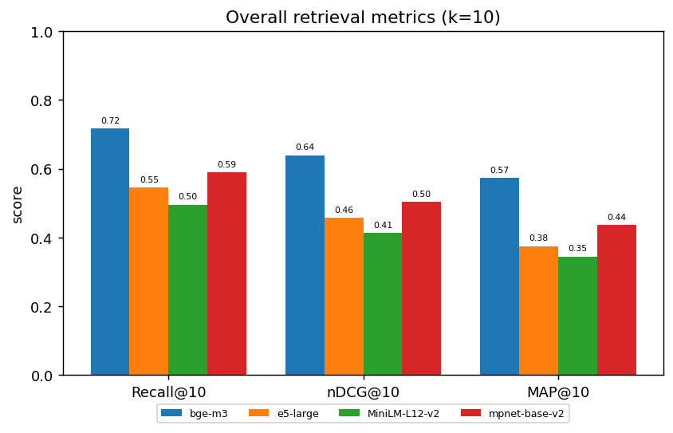
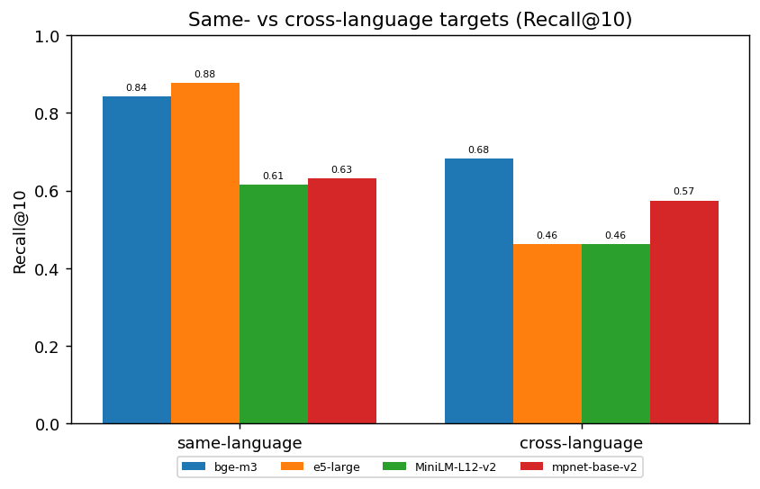
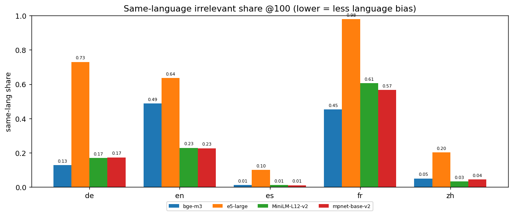
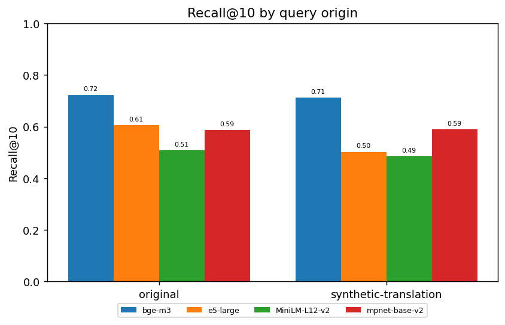
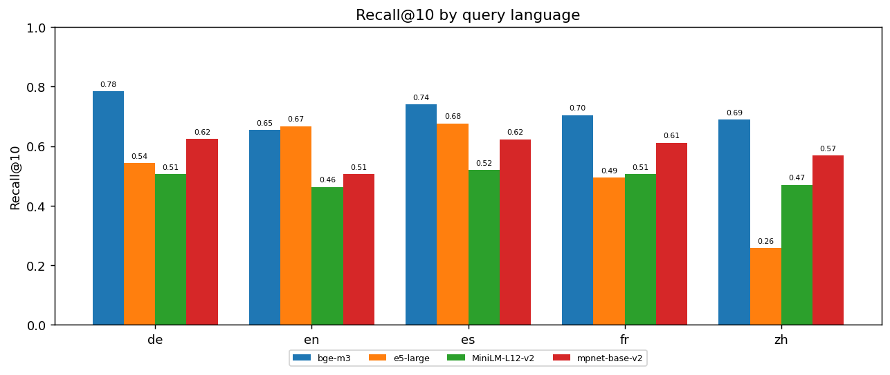
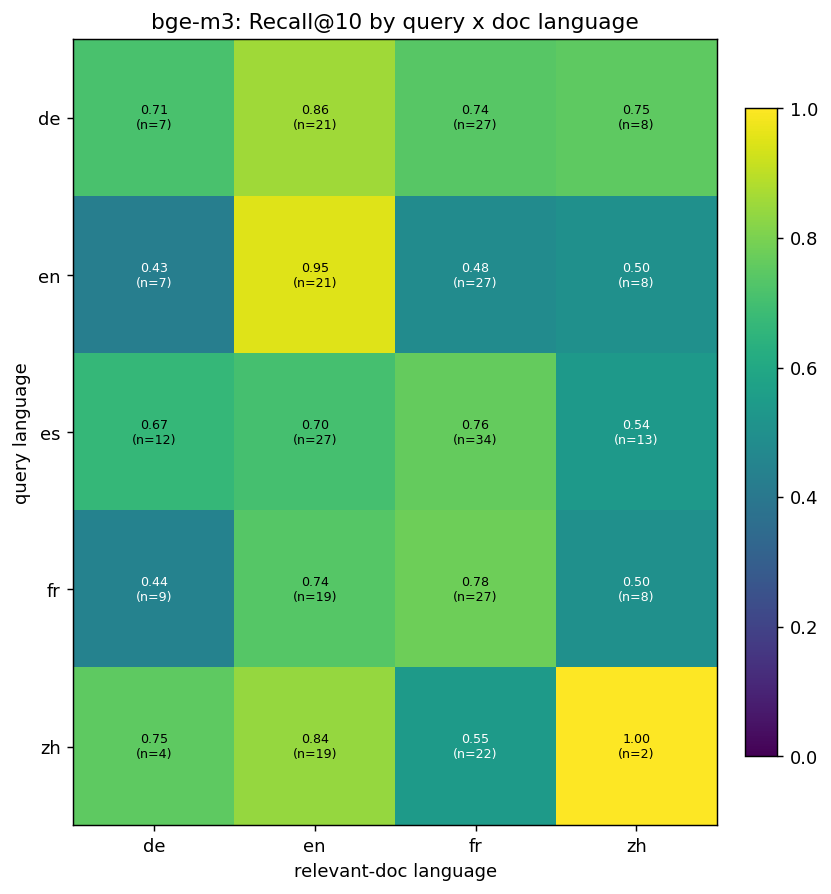

# Findings — Multilingual chemical‑patent QAC retrieval

**Run:** `20260601-235117_137questions` · dataset `MehdiAstaraki/multi-lingual-qac-chem-patents`
(`multilingual` variant) · 4 embedding models · main metric **Recall@10**.
Sources: [summary.md](summary.md), [mteb_tables/model_comparison.md](mteb_tables/model_comparison.md),
[question_analysis/question_level_analysis.md](question_analysis/question_level_analysis.md).

**Dataset:** 137 questions (57 original, 80 synthetic‑translation) in 5 query languages
(de 27, en 27, es 34, fr 27, zh 22); corpus 1,110 docs; 322 relevant (query, doc) pairs
(~2.35/query). Each question targets a patent, and the relevant set is that patent's family
across languages — so the benchmark is fundamentally about **cross‑lingual** retrieval.

---

## 1. Which model is best

**`BAAI/bge-m3` wins every quality metric, decisively.**

| Rank | Model | Recall@10 | Recall@100 | nDCG@10 | MAP@10 | MRR@10 | hit@10 | Eval s |
|---:|---|---:|---:|---:|---:|---:|---:|---:|
| 1 | **BAAI/bge-m3** | **0.717** | **0.909** | **0.639** | **0.574** | **0.672** | **0.847** | 40.9 |
| 2 | …/paraphrase‑multilingual‑mpnet‑base‑v2 | 0.589 | 0.825 | 0.503 | 0.437 | 0.531 | 0.708 | 17.5 |
| 3 | intfloat/multilingual‑e5‑large | 0.545 | 0.849 | 0.457 | 0.375 | 0.517 | 0.708 | 39.8 |
| 4 | …/paraphrase‑multilingual‑MiniLM‑L12‑v2 | 0.495 | 0.829 | 0.414 | 0.345 | 0.449 | 0.650 | 16.7 |

- bge‑m3 leads the field by **+13 Recall@10 points** over the next model and finds a relevant
  doc in the top‑10 for **85%** of questions (hit@10 0.847).
- **mpnet‑base‑v2 is the best of the rest** — it beats the larger e5‑large on every top‑10 metric
  (Recall@10 0.589 vs 0.545, nDCG@10 0.503 vs 0.457) at ~half the runtime.
- e5‑large only pulls ahead at depth‑100 recall (0.849 vs 0.825) — it eventually finds the docs
  but ranks them worse in the top‑10.

---

## 2. Retrieval mode — same‑language vs cross‑language targets

This is the most important structural finding. For every model, retrieving a **same‑language**
relevant doc is far easier than a **cross‑language** one — cross‑lingual is the benchmark's hard
mode.

| Mode (mean Recall@10) | bge‑m3 | e5‑large | MiniLM | mpnet |
|---|---:|---:|---:|---:|
| same‑language target | 0.842 | **0.877** | 0.614 | 0.632 |
| cross‑language target | **0.682** | 0.461 | 0.462 | 0.574 |
| **drop (same → cross)** | −0.16 | **−0.42** | −0.15 | −0.06 |

- **bge‑m3 is the only genuinely cross‑lingual model**: 0.682 cross‑language recall, +0.11 over
  the next best. That cross‑lingual strength is where its overall win comes from.
- **e5‑large is essentially a same‑language matcher**: best of all at same‑language (0.877) but
  collapses cross‑language (0.461), a 0.42 gap. It leans on language itself as a retrieval signal.
- This is corroborated by the **same‑language irrelevant share @100** — of the *wrong* docs each
  model pulls into the top‑100, the fraction that are in the query's own language:

  | same‑lang irrelevant@100 | overall | de | en | es | fr | zh |
  |---|---:|---:|---:|---:|---:|---:|
  | e5‑large | **0.519** | 0.730 | 0.636 | 0.101 | **0.978** | 0.201 |
  | bge‑m3 | 0.222 | 0.128 | 0.488 | 0.012 | 0.453 | 0.050 |
  | mpnet | 0.200 | 0.173 | 0.227 | 0.011 | 0.567 | 0.044 |
  | MiniLM | 0.206 | 0.170 | 0.229 | 0.012 | 0.606 | 0.033 |

  

  e5‑large's false positives are dominated by same‑language documents (French: 98%!), i.e. it
  clusters by language rather than by meaning — exactly the failure the cross‑language drop shows.

---

## 3. Strategy — original vs synthetic‑translation questions

80 of the 137 questions are machine translations of the original (English‑authored) question.
Does translating the question hurt retrieval?

| Recall@10 | bge‑m3 | e5‑large | MiniLM | mpnet |
|---|---:|---:|---:|---:|
| original (57) | 0.722 | 0.605 | 0.509 | 0.588 |
| synthetic‑translation (80) | 0.712 | 0.502 | 0.485 | 0.590 |
| **change** | −0.01 | **−0.10** | −0.02 | +0.00 |

- **bge‑m3 and mpnet are translation‑robust** (essentially flat) — the QAC translation step does
  not degrade them, which validates using translated questions in the benchmark.
- **e5‑large is the most translation‑sensitive** (−0.10): it is hurt both by translation artifacts
  and by being asked to match across languages (Section 2 + 4).

---

## 4. By query language

| Recall@10 | bge‑m3 | e5‑large | MiniLM | mpnet |
|---|---:|---:|---:|---:|
| de (27) | **0.784** | 0.543 | 0.506 | 0.623 |
| en (27) | 0.654 | 0.667 | 0.463 | 0.506 |
| es (34) | 0.740 | 0.676 | 0.520 | 0.623 |
| fr (27) | 0.704 | 0.494 | 0.506 | 0.611 |
| zh (22) | 0.689 | **0.258** | 0.470 | 0.568 |

- **bge‑m3 is consistent across all five languages** (0.65–0.78) — no weak spot.
- **e5‑large collapses on Chinese**: Recall@10 0.258 and MRR@10 just **0.128** (vs 0.62–0.69 for
  the others) — it barely works for zh, while being competitive on en/es. This single weakness, plus
  the cross‑language gap, explains why a normally strong model lands 3rd here.
- MiniLM is weakest but flat across languages; mpnet is a solid mid‑tier everywhere.

---

## 5. Language pair (question language → relevant‑doc language)

Where does retrieval actually succeed across the language boundary? The matrix below is for the
best model (bge‑m3): each cell is the fraction of relevant docs in that (query‑lang → doc‑lang)
direction found in the top‑10 (n = number of relevant pairs).

| q ↓ \ doc → | de | en | fr | zh |
|---|---:|---:|---:|---:|
| **de** | 0.71 (7) | 0.86 (21) | 0.74 (27) | 0.75 (8) |
| **en** | 0.43 (7) | **0.95 (21)** | 0.48 (27) | 0.50 (8) |
| **es** | 0.67 (12) | 0.70 (27) | 0.76 (34) | 0.54 (13) |
| **fr** | 0.44 (9) | 0.74 (19) | 0.78 (27) | 0.50 (8) |
| **zh** | 0.75 (4) | 0.84 (19) | 0.55 (22) | 1.00 (2) |

- **Same‑language diagonal is strongest** (en→en 0.95, fr→fr 0.78, de→de 0.71) — consistent with
  Section 2.
- **English is the pivot language**: every other language finds **English** documents well
  (de→en 0.86, zh→en 0.84, fr→en 0.74, es→en 0.70). English is the best‑represented language in
  the corpus, so it acts as a hub.
- **Asymmetry — English queries are the weakest at finding *foreign* docs**: en→de 0.43,
  en→fr 0.48, en→zh 0.50. So foreign→English is easy, but English→foreign is hard; the relationship
  is not symmetric.
- **Hardest directions overall:** anything **→ German** (en→de 0.43, fr→de 0.44) and English→French
  (0.48). German targets and English‑origin cross‑lingual queries are where bge‑m3 loses the most.
- **`es` is query‑only** (no Spanish column): the corpus has no Spanish documents (EPO publishes in
  en/de/fr), so Spanish questions are purely a cross‑lingual probe into other languages.

---

## 6. Conclusions

1. **Pick `BAAI/bge-m3`.** It wins every quality metric, is consistent across all languages, is
   translation‑robust, and is the only model that retrieves well **across** languages — which is
   what this dataset is built to test.
2. **The discriminating axis is cross‑lingual retrieval.** Same‑language retrieval is "easy" for
   all four models; the gap between models opens up entirely on cross‑language targets. Report
   cross‑language Recall@10 alongside the headline number.
3. **e5‑large underperforms its reputation here**, for two concrete reasons: it is evaluated as a
   raw SentenceTransformer **without its recommended `query:` / `passage:` prefixes**, and it is
   weak on Chinese. If it is kept in the suite, re‑run it with the proper instruction prefixes
   before drawing conclusions.
4. **Where to improve the corpus/models next:** German targets and English→foreign directions are
   the weakest cells — adding/strengthening German and non‑English document coverage (and
   English→foreign training signal) would move the hardest part of the benchmark.

### Caveats
- 137 questions total; some language‑pair cells are small‑n (zh→zh n=2, zh→de n=4) — treat those
  cells as indicative, not precise.
- `es` is query‑only (no Spanish corpus); the same‑language number for Spanish is therefore not
  defined and Spanish is always a cross‑lingual case.
- Figures regenerate automatically with each run: `question_analysis/plots/` (see
  [question_level_analysis.md](question_analysis/question_level_analysis.md) for the exact tables and
  [question_level_metrics.csv](question_analysis/question_level_metrics.csv) for per‑question data).
